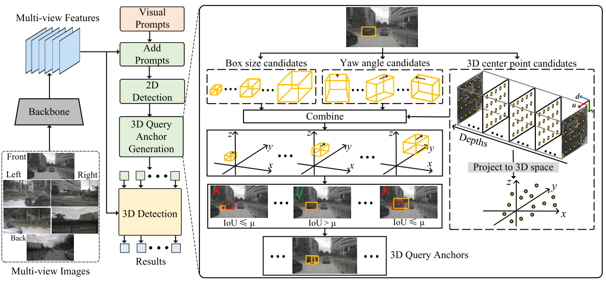

<div align="center">
<h1>[CVPR 2024] Enhancing 3D Object Detection with 2D Detection-Guided Query Anchors</h1>
</div>


<div align="center">
  
</div><br/>


## Introduction

This repository is the official implementation of our paper "Enhancing 3D Object Detection with 2D Detection-Guided Query Anchors, CVPR 2024 [](https://arxiv.org/abs/2403.06093)". Our code is based on [StreamPETR](https://github.com/exiawsh/StreamPETR).

## Getting Started

Please follow the docs below.

1. [**Environment Setup.**](./docs/setup.md)
2. [**Data Preparation.**](./docs/data_preparation.md)
3. [**Inference.**](./docs/inference.md)

## Results on NuScenes Val Set.

| Methods                 | Backbone | Image Size | NDS  | mAP  | config                                                       | model                                                        |
| ----------------------- | -------- | ---------- | ---- | ---- | ------------------------------------------------------------ | ------------------------------------------------------------ |
| StreamPETR              | V2-99    | 320×800    | 57.1 | 48.2 | -                                                            | -                                                            |
| StreamPETR-QAF2D (Ours) | V2-99    | 320×800    | 58.8 | 49.8 | [config](projects/configs/PersPETR/persdetr3d_vov_800_bs2_seq_24e.py) | [model](https://drive.google.com/file/d/1JtGKOGjlOJe3yJyC58GASNE-uoa91ozn/view?usp=sharing) |

Comparison of the base detectors and their QAF2D enhanced version on the nuScenes validation split.

### Note
Due to some internal policies, we do not release the full codebase, and the current 2D detection results are read from a saved file.  

## Citation

If you find QAF2D  useful in your research or applications, please consider  citing it. Thank you. 

```bibtex
@inproceedings{ji2024enhancing,
  title={Enhancing 3D Object Detection with 2D Detection-Guided Query Anchors},
  author={Ji, Haoxuanye and Liang, Pengpeng and Cheng, Erkang},
  booktitle={Proceedings of the IEEE/CVF Conference on Computer Vision and 
  Pattern Recognition},
  pages={21178--21187},
  year={2024}
}
```

